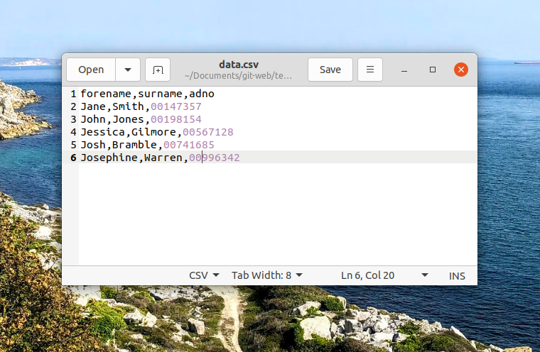
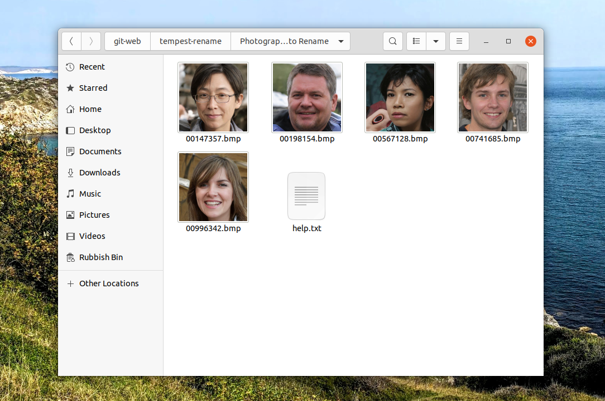
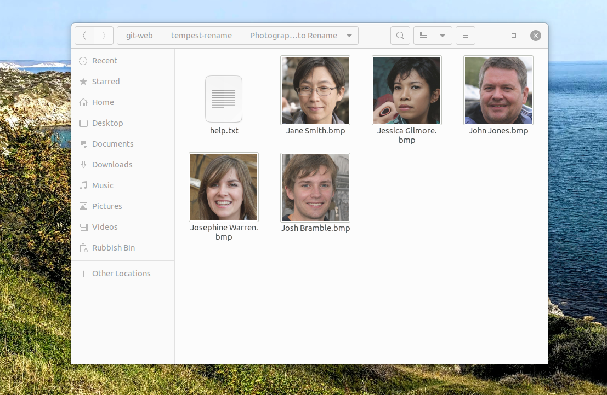

## Why

We needed a quick and simple way to convert ADNO images to Forename and Surname, this small application uses Python to import data from a CSV and folder directory to rename matching files.

**Example Data CSV**

**Before Rename**

**After Rename**

## How to use

1. Export the student SIMS report into a CSV with the following columns forename, surname, adno
2. Save the report as 'data.csv' into this root of this application overriding the example file - ensure the csv contains the leading '00'.
3. Place the Tempest photographs into the folder 'Photographs to Rename', these should be named with the student adno.

Run the main.py script and the matched files will be renamed.

## Warning

Please review the script before executing, this is a work in progress script and I take no responsiblity for any damages caused.
